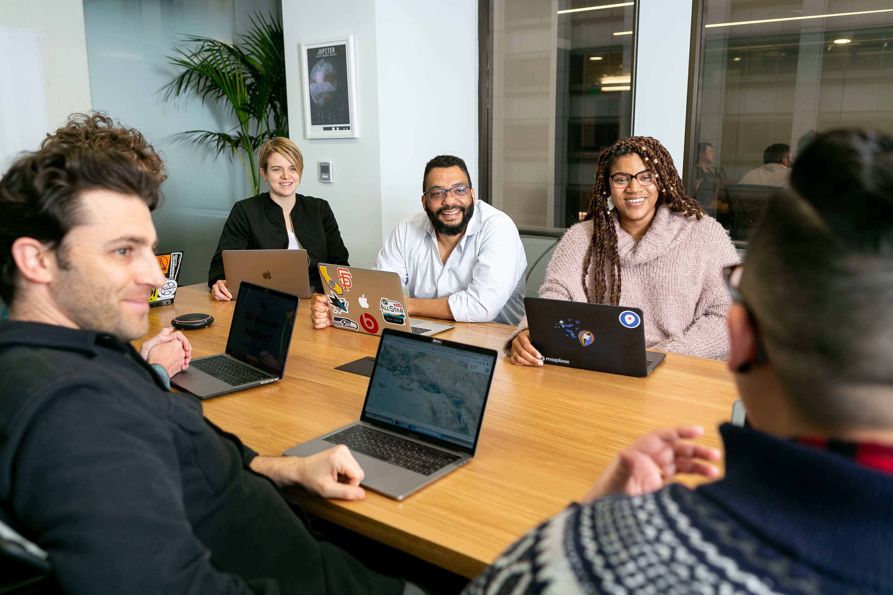
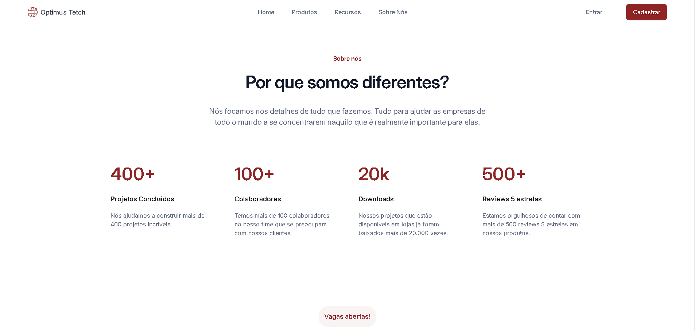

# 💼 OptimusTech Landing Page

<div align="center">



### 🌐 Landing page institucional com foco em UI, responsividade e organização de layout


</div>

---

## 🚀 Demonstração

🔗 **Live Preview:** [https://anaclarissi.github.io/paginas-de-vagas/](https://anaclarissi.github.io/paginas-de-vagas/)

💻 **Repositório:** [https://github.com/anaClarissi/paginas-de-vagas](https://github.com/anaClarissi/paginas-de-vagas)

---

## 📷 Preview

<div align="center">



</div>

---

## 🧠 Sobre o projeto

Este projeto é uma **landing page institucional**, desenvolvida de forma independente como prática de **HTML, CSS e organização de layout**.

A proposta foi criar uma interface moderna para uma empresa fictícia (**OptimusTech**), com foco em:

* 🎯 Estrutura de página completa (header, main e footer)
* 🎨 Design limpo e profissional
* 📱 Responsividade com Bootstrap + CSS
* 🧩 Organização de conteúdo em seções

---

## ⚙️ Funcionalidades

* 🧭 Navbar responsiva com menu colapsável
* 🏢 Seção institucional ("Sobre nós")
* 📊 Exibição de métricas da empresa
* 💼 Listagem de vagas abertas
* 🗣 Seção de depoimentos
* 📩 Formulário de inscrição (newsletter)
* 📱 Layout responsivo

---

## 🛠 Tecnologias utilizadas

<div align="center">

| Tecnologia   | Descrição                       |
| ------------ | ------------------------------- |
| HTML5        | Estrutura semântica             |
| CSS3         | Estilização personalizada       |
| Bootstrap 5  | Layout responsivo e componentes |
| Google Fonts | Tipografia (Inter)              |

</div>

---

## 📂 Estrutura do projeto

```bash
7daysofcode-html-css/
│
├── index.html
├── src/
│   ├── css/
│   │   ├── style.css
│   │   └── section.css
│   ├── img/
│   │   ├── header/
│   │   └── main/
```

---

## 🧩 Como funciona

* Estrutura baseada em **HTML semântico**
* Uso do **Bootstrap** para:

  * Navbar responsiva
  * Grid e layout base
* Estilização customizada com:

  * variáveis CSS (`:root`)
  * classes reutilizáveis
* Layout dividido em seções:

  * `#sobre`
  * `#metricas`
  * `#vagas`
  * `#depoimentos`

---

## 🎨 Destaques do projeto

* 🎯 Estrutura completa de landing page
* 🧠 Combinação de Bootstrap + CSS próprio
* 📱 Responsividade bem aplicada
* 🧩 Separação de estilos por arquivos
* 🎨 Identidade visual consistente
* 📦 Código organizado e escalável

---

## 📦 Como rodar o projeto

```bash
# Clone o repositório
git clone LINK_DO_REPOSITORIO

# Acesse a pasta
cd 7daysofcode-html-css

# Abra o index.html no navegador
```

---

## 📌 Aprendizados

Durante este projeto, foram praticados:

* Estruturação de páginas completas
* Uso de Bootstrap na prática
* Organização de CSS em múltiplos arquivos
* Criação de layouts responsivos
* Uso de variáveis CSS
* Boas práticas de HTML semântico

---

## ✨ Melhorias futuras

* [ ] Adicionar interatividade com JavaScript
* [ ] Melhorar acessibilidade (ARIA)
* [ ] Criar versão dark mode 🌙
* [ ] Validação real do formulário
* [ ] Melhorar responsividade em telas menores

---

## ⭐ Contribuição

Contribuições são bem-vindas!

1. Fork o projeto
2. Crie uma branch
3. Faça suas alterações
4. Envie um Pull Request

---

## 📄 Licença

Este projeto está sob a licença MIT.

---

<div align="center">

✨ Projeto desenvolvido de forma independente 🚀 ✨

</div>
